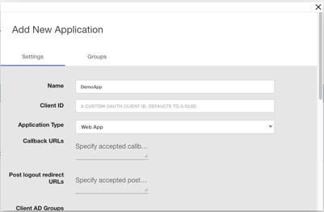

# LabShare Auth OpenId Connect Authorization Code Flow Sample

This is a sample to demonstrate how to use LabShare Auth as an OpenID Connect (OIDC) provider for a Web app.
It includes the following functionality:

* Login - redirecting users to the login page for authentication
  
* Logout - destroying the local session and revoking the token at the OP

* User Info - fetching profile information from the OP

The code was adapted from a [OneLogin](https://www.onelogin.com/) [sample application](https://github.com/onelogin/onelogin-oidc-node/tree/master/1.%20Auth%20Flow).

This is a NodeJS app that uses [Express.js](https://expressjs.com/),
[Passport.js](http://www.passportjs.org/), and the [Passport-OpenIdConnect](https://github.com/jaredhanson/passport-openidconnect)
module for managing user authentication.

## Setup

In order to run this sample you need to setup a Web app in the client configuration section of the admin UI for LabShare Auth.  

1. Clone this repo
2. Rename `sample.env` to `.env` and update the **client_id** and
**client_secret** you obtained from LSAuth as well as the Redirect Uri of your local site.

* _Make sure that the Redirect URI matches what you specified in the admin UI. NOTE: the redirect URI must use HTTPS_

## Run

Make sure you have NodeJS installed.
From the command line run

```bash
> npm install
> npm start
```

### Local testing

By default these samples will run on `https://local.mylocal.org:3001/`.

You will need to add your callback url to the list of approved **Callback URLs** via the admin UI. e.g. `https://local.mylocal.org:3001/oauth/callback`

## Registering this client

LabShare Auth supports the Authorization Code Grant OAuth2 flow for traditional server-side web applications.

* Register a "web" Client on the Applications Dashboard of the Auth UI.
** Click "APPS" in the left nav menu
** Click "+ ADD NEW" to open the "Add New Application" dialog.
** ...



* Obtain the new application's client ID and client secret and store them securely on the web application server.

The PassportJS OidcStrategy will the GET /auth/{tenantID}/authorize endpoint to obtain an Authorization Code and then exchange it for an access token via the POST /auth/{tenantID}/token endpoint.

## Configuring the environment

The following environment variable are used.  They can be configured in the .env file for development.

```bash
## Specify the host name and port to listen on
## NOTE: you must use HTTPS
HOST_NAME=local.mylocal.org
PORT=3001

## The redirect URI is the address where the OIDC provider redirects to the client after login
## NOTE: the redirect_uri must be registered as a callback URL on the OP.
## NOTE: the spec requires using https protocol.
OIDC_REDIRECT_URI=https://local.mylocal.org:3001/oauth/callback
## NOTE: The post_logout_redirect_uri must also be registered on the OP.
POST_LOGOUT_REDIRECT_URI=https://local.mylocal.org:3001/

## cert and key files for enableing TLS.  Needed since HTTPS is required for callbacks.
## NOTE: If you are using a TLS termination proxy, you can ignore this and configure HTTP internally.
## For dev you can generate self signed certs using openssl, e.g.,
## > openssl req -nodes -new -x509 -keyout localhost.key -out localhost.cert
TLS_KEY_FILE=localhost.key
TLS_CERT_FILE=localhost.cert

## OIDC Base URI is the address of the OIDC server
## Note that the tenant name ("ls" in this example) is included at the end of the address.
OIDC_BASE_URI=https://a-ci.labshare.org/_api/auth/ls

## OIDC Client ID and Client Secret can be obtained from the Admin UI after registering the client.
OIDC_CLIENT_ID=sampleapp
OIDC_CLIENT_SECRET=bb5c8e0d-00a2-40ce-9766-64f24032b84c
```

## How it Works

### Getting the OIDC Configuration

OIDC information is queried dynamically at startup.  The code retrieves the issuer and various OIDC endpoints by querying the well known configuration endpoint as shown below:

```javascript
request(`${OIDC_BASE_URI}/.well-known/openid-configuration`,
  { json: true },
  (err, res, body) => {
    if (err) { throw Error(err); }
    issuer = body.issuer;
    authorizationURL = body.authorization_endpoint;
    userInfoURL = body.userinfo_endpoint;
    tokenURL = body.token_endpoint;
    endSessionURL = body.end_session_endpoint;
    // ...
  }
);
```

### Protecting a route

When configuring an Express route a callback function is used to check if the user is athenticated.  In this example, the function `checkAuthentication` is passed in the `app.get()` call.  The function will redirect the browser to an unprotected page if the user is not authenticated.

```javascript
app.get('/some_path',checkAuthentication,function(req,res){
    //do something only if user is authenticated
});
```

Here is the code for `checkAuthentication`. It uses the Passport `isAuthenticated` method on the request object to determine the authentication status.

```javascript
function checkAuthentication(req, res, next) {
  if (req.isAuthenticated()) {
    next();
  } else {
    res.redirect("/");
  }
}
```

### Logging in

TBD

### Logging out

TBD
